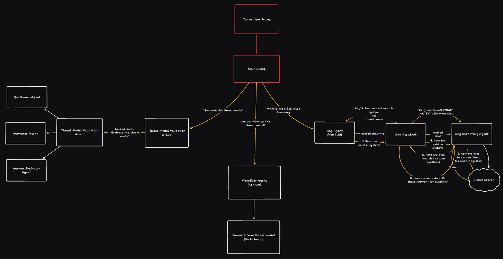

## Autogen Privacy Helper

This is a simple project that demonstrates the use of [autogen](https://github.com/microsoft/autogen) in the context of a Microsoft Teams AI bot.
This bot models privacy review helper. The group is built for two purposes currently:
1. Threat model validation
2. RAG Search

The basic structure of the autogen group is as follows:

## How to run the project
This project uses Teams AI library and autogen.

### Prerequisites
1. Install the Teams Toolkit extension for Visual Studio Code - [Link](https://learn.microsoft.com/en-us/microsoftteams/platform/toolkit/teams-toolkit-fundamentals)
2. Make sure you have conda

### Steps
1. Clone repo
2. run `conda env create -f environment.yml`
3. run `poetry install`
3. Update .env. Make sure it includes either `OPENAI_KEY` or `AZURE_OPENAI_API_KEY` with `AZURE_OPENAI_ENDPOINT`. If you look for `build_llm_config` in the code, you will see how it builds the config for the model.
3. Open the project in VSCode. Make sure you have the Teams Toolkit (TTK) extension installed.
5. Go to the TTK extension, then click "local" debug under environment. This will create a package under appPackage/build folder and start Teams up. It'll also do the installation for your bot on Teams.